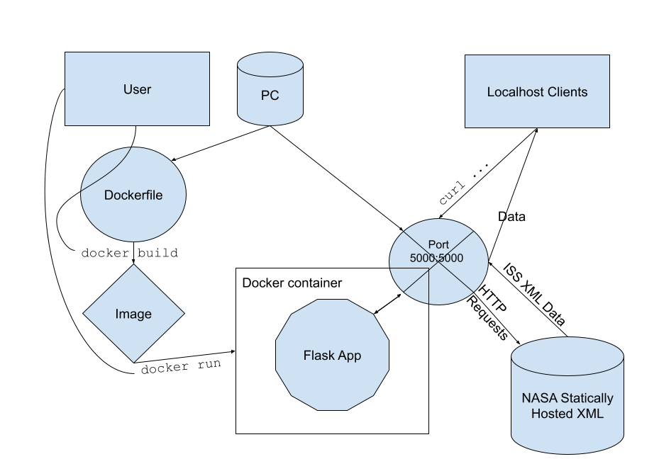

# ISS Tracker
## Project Description
This script contains an API using the Flask engine which retrieves data from [NASA's site](https://spotthestation.nasa.gov/trajectory_data.cfm) and offers a variety of functions to pull data via various routes.

## File Description
### `iss_tracker.py`
Contains all functions for retrieval, preprocessing, and description of data as well as routing for the REST API to return information about NASA data.
### `test_iss_tracker.py`
Contains basic validation tests for main script. Since these scripts only make API calls, they can be run as normal python functions by changing the function calls in the main script as long as the file is being executed on the same device as the API. If deployed to be public facing, one would simply have to edit the address targeted by the HTTP requests.

## Instructions on Docker operation
### Diagram

### Server-side:
To build the image using default instruction, run `docker compose up` from the same directory as the `docker-compose.yml` file.
To detach the container to reuse the same terminal, add a `-d` (detach) flag to the end of the command.

### Client-side:
| Route                       | Method |                                                              Parameters                                                              | Return Type | Output Description                                                                                           |
|:----------------------------|:------:|:------------------------------------------------------------------------------------------------------------------------------------:|:-----------:|:-------------------------------------------------------------------------------------------------------------|
| `/comment`                  | `GET`  |                                                                 None                                                                 |    `str`    | Returns contents of all `COMMENT` xml objects as a formatted string                                          |
| `/header`                   | `GET`  |                                                                 None                                                                 |   `JSON`    | Returns contents of xml objects contained in `header` object as a dictionary                                 |
| `/metadata`                 | `GET`  |                                                                 None                                                                 |   `JSON`    | Returns contents of xml objects contained in `metadata` object as a dictionary                               |
| `/epochs`                   | `GET`  |                                                                 None                                                                 |   `JSON`    | Returns entire dataset as dictionary of column tags and list of records                                      |
| `/epochs?limit=-1&offset=0` | `GET`  | (Optional) offset: int   First index of records to return    (Optional) limit: int   Maximum number of records to return |   `JSON`    | Returns dataset, beginning at `offset` and `limit` number of records                                         |
| `/epochs/<epoch>`           | `GET`  |                                epoch: string representing epoch following format `%Y-%jT%H:%M:%S.%fZ`                                |   `JSON`    | Returns information about the target epoch                                                                   |
| `/epochs/<epoch>/speed`     | `GET`  |                                epoch: string representing epoch following format `%Y-%jT%H:%M:%S.%fZ`                                |   `JSON`    | Returns speed at the target epoch (in m/s)                                                                   |
| `/epochs/<epoch>/location`  | `GET`  |                                epoch: string representing epoch following format `%Y-%jT%H:%M:%S.%fZ`                                |   `JSON`    | Returns latitude, longitude, altitude, (in decimal degrees format) and nearest city data at the target epoch |
| `/now`                      | `GET`  |                                                                 None                                                                 |   `JSON`    | Returns speed and location information about the most recent epoch                                           |

1. Run `curl http://localhost:5000/` using the above API routes:
2. Use JSON output according to X, Y, Z, X_DOT, Y_DOT, or Z_DOT or specialized keys for values calculated server-side.

#### Examples:
* `curl http://localhost:5000/comment`
* `curl http://localhost:5000/header`
* `curl http://localhost:5000/metadata`
* `curl http://localhost:5000/epochs`
* `curl http://localhost:5000/epochs?limit=10&offset=5`
* `curl http://localhost:5000/epochs/2024-090T12:00:00.000Z`
* `curl http://localhost:5000/epochs/2024-090T12:00:00.000Z/speed`
* `curl http://localhost:5000/epochs/2024-090T12:00:00.000Z/location`
* `curl http://localhost:5000/now`
Note: replace epoch string with a target epoch string contained in the data at the time of use. (Perhaps survey all epochs and choose a target one to analyze or use offset and limit.)